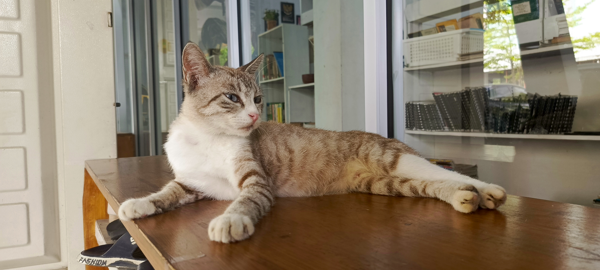

<h2 align="center">Hello World!, I'm Lionel 👋🏼:</h2>

  🌱 I’m currently learning <strong>C++, TailWind, Next-JS</strong>

 
  
  
  

<h2 align="center">💻 Tech Stack:</h2>

<h2 align="center">⚡ Stats ⚡</h2>
 

  
  &nbsp;&nbsp;
  
   

<h2 align="center">My Contributions</h2>

